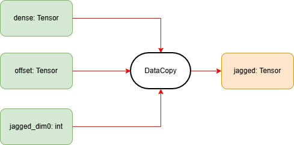

**说明**

本算子仅支持NPU调用。

# 产品支持情况
| 硬件型号              | 是否支持                  |
| -------------------- | ------------------------ |
| Atlas A2训练系列产品  | 是  |
| Atlas A3训练系列产品  | 是  |
| Atlas 推理系列产品    | 是  |

# dense_to_jagged算子目录层级

```shell
-- dense_to_jagged
   |-- v220
      |-- op_host                 # 算子host侧实现
      |-- op_kernel               # 算子kernel侧实现
      |-- dense_to_jagged.json    # 算子原型配置
      |-- dense_to_jagged.png     # 算子实现原理图
      |-- README.md               # 算子说明文档
      |-- run.sh                  # 算子编译部署脚本
```

# 功能

将密集三维张量(dense Tensor)转换为锯齿状二维张量(jagged Tensor)，用于处理变长序列数据。

# 算子实现原理



输入:

```python
dense = [
 [[1, 2], [0, 0], [0, 0], [0, 0]],
 [[3, 4], [5, 6], [7, 8], [0, 0]],
 [[9, 10], [11, 12], [0, 0], [0, 0]],
 [[13, 14], [0, 0], [0, 0], [0, 0]],
 [[15, 16], [17, 18], [19,20], [21, 22]]
]

offset = [0, 1, 4, 6, 7, 11]

jagged_dim0 = 11
```

输出：

```python
jagged_dense = 
[[1, 2], [3, 4], [5, 6], [7, 8], [9, 10], [11, 12], [13, 14], [15, 16], [17, 18], [19, 20], [21, 22]]
```

# 算子输入与输出
|  名称  |  输入/输出  |  数据类型  |  数据格式  |  范围  |  说明  |
|  ---- |  ---- |  ----  |  ----  |  ----  |  ----  |
|  dense | 输入 | bfloat16/float16/float32/int32/int64 | [dim0, dim1, dim2] | dim0 <= std::numeric_limits<int>::max() - 1 | 仅支持三维 |
|  offset | 输入 | int32/int64 | [dim0 + 1] | dim0 + 1 <= std::numeric_limits<int>::max()<br>数值必须从0开始依次递增 | 仅支持一维<br>offset内元素需用户自行保证合法性，否则可能导致算子执行失败 |
|  jagged_dim0 | 输入(属性) | int | NA | 必须等于offset[-1] | NA |
|  jagged_dense | 输出 | bfloat16/float16/float32/int32/int64 | [jagged_dim0, dim2] | NA | NA |

# 算子编译部署

算子编译请参考[RecSDK\cust_op\README.md](../../../../README.md)中"单算子使用说明"-"算子编译"章节。

注：详细算子调用示例参考Pytorch框架下[README.md](../../../../framework/torch_plugin/torch_library/dense_to_jagged/README.md)