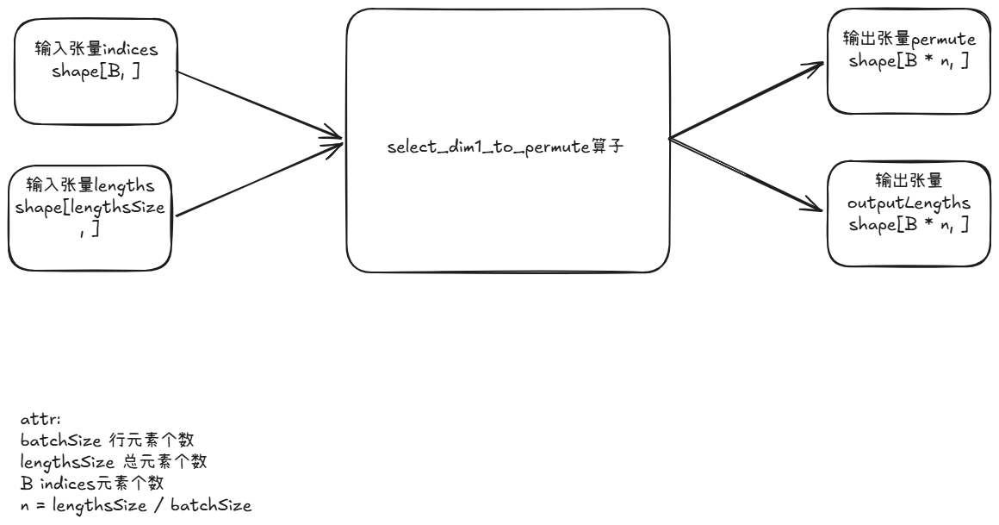

**说明**

本算子仅支持NPU调用。

# 产品支持情况
| 硬件型号              | 是否支持                  |
| -------------------- | ------------------------ |
| Atlas A5训练系列产品    | 是  |

# select_dim1_to_permute算子目录层级
```shell
-- select_dim1_to_permute
   |-- c310
      |-- op_host                 # 算子host侧实现
      |-- op_kernel               # 算子kernel侧实现
      |-- select_dim1_to_permute.json   # 算子原型配置
      |-- README.md               # 算子说明文档
      |-- run.sh                  # 算子编译部署脚本
```

# 功能

将元素个数为batch_size的select_dim1 通过attr属性扩展到多个batch_num（lengthsSize / batchSize），生成permute,
同时根据select_dim1中的元素值，将permute中的元素值对应到lengths中的元素值。


# 算子实现原理



算子工作原理说明：
1. 输入张量indices ND格式， 支持INT32, shape = (B, ) 不可为空，该元素为稀疏矩阵下标的排列，只包含一个batch
2. attr属性 batchSize(int, 计算输入): 稀疏矩阵中一行中包含元素个数
3. attr属性 lengthsSize(int, 计算输入): 稀疏矩阵总长度
4. 输出张量 permute ND格式， 支持INT32， shape = (B * n, ), 计算结果，为indices根据attr得到整个lengths的下标排列
5. 请注意算子输入shape受显存大小限制。

输入:
```python
# 表示每个batch中取下标为 1, 0, 4, 2的元素
indices = [1, 0, 4, 2]
lengths = [1, 2, 3, 4, 5,
           6, 7, 8, 9, 10,
           11, 12, 13, 14, 15,
           16, 17, 18, 19, 20]
# 表示一个batch有5个元素
batchSize = 5
# 表示整个有20个元素
lengthsSize = 20
```
输出:
```python
# 返回每个batch的具体下标
permute = [1, 0, 4, 2,
           6, 5, 9, 7,
           11, 10, 14, 12,
           16, 15, 19, 17]
# 返回lengths[permute[idx]] (i >= 0, i < lengthsSize)
outputlengths = [2, 1, 5, 3,
                 7, 6, 10, 8,
                 12, 11, 15, 13,
                 18, 17, 20, 19]
```
# 算子输入与输出
| 名称      | 输入/输出 | 参数类型 | 数据类型         | 数据格式       | 范围         | 说明                                  |
|---------|------------|------|--------------|------------|------------|----------------------------------------|
|indices  | 输入       | Tensor | int32/int64 | ND | [B, ] | |
|lengths  | 输入       | Tensor | int32/int64 | ND | [B, ] | |
|batchSize| 输入(属性) | Int | int |  |  |
|lengthsSize | 输入(属性) | Int | int |  | | lengthsSize是batchSize的整数倍 |
|permute | 输出 | Tensor | int32/int64 | ND | [B * n, ] | n = (lengthsSize / batchSize) |
|outputlengths | 输出 | Tensor | int32/int64 | ND | [B * n, ] | n = (lengthsSize / batchSize) |


# 算子编译部署

算子编译请参考[RecSDK\cust_op\README.md](../../../../README.md)中"单算子使用说明"-"算子编译"章节。

注：详细算子调用示例参考Pytorch框架下[README.md](../../../../framework/torch_plugin/torch_library/in_linear_silu/README.md)