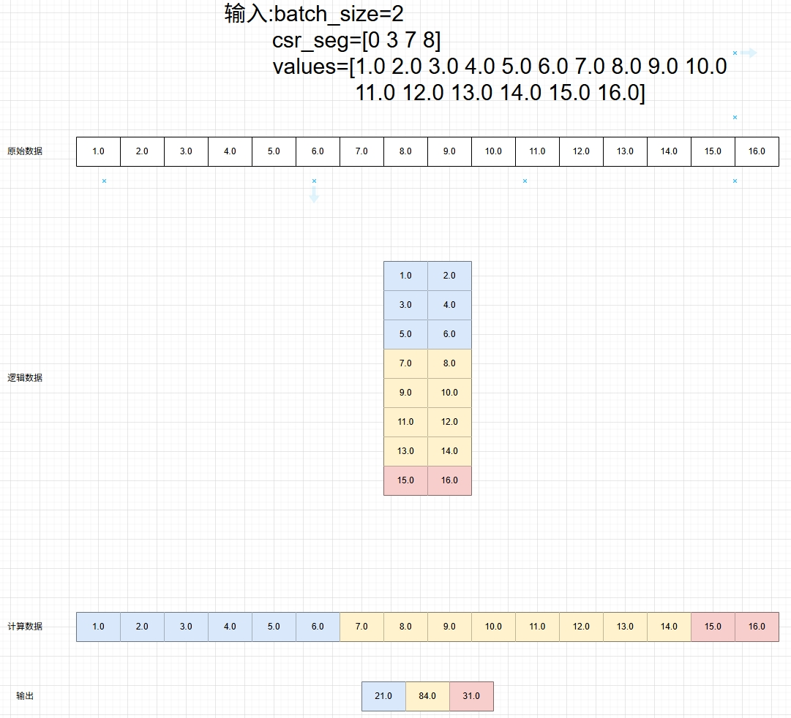

**说明**

本算子仅支持NPU调用。

# 产品支持情况
| 硬件型号           | 是否支持 |
|----------------|------|
| Atlas A2训练系列产品 | 是    |
| Atlas A3训练系列产品 | 是    |
| Atlas 推理系列产品   | 是    |
| Ascend 950PR   | 是    |

# segment_sum_csr算子目录层级

```shell
-- segment_sum_csr
├── c310
│   └── run.sh                         # Ascend 950PR编译脚本
├── segment_sum_csr.cpp                # pytorch适配层代码
└── v220                               
    ├── README.md                      # segment_sum_csr算子文档
    ├── op_host                        # host侧代码
    │   ├── segment_sum_csr.cpp
    │   └── segment_sum_csr_tiling.h
    ├── op_kernel                      # kernel侧代码
    │   └── segment_sum_csr.cpp
    ├── run.sh                         # A2编译脚本
    ├── segment_sum_csr.json           # 算子配置脚本
    └── segment_sum_csr原理图.jpg

```

# 功能

根据输入batch_size和csr_seg计算values中各个分段的和。

# 算子实现原理



如上图所示，假设输入是:

```shell
batch_size=2
csr_seg=[0 3 7 8]
values=[1.0 2.0 3.0 4.0 5.0 6.0 7.0 8.0 9.0 10.0 11.0 12.0 13.0 14.0 15.0 16.0]
```

原始数据values是一个一维的张量，batch_size是每一行的长度，相当于将values reshape成n x batch_size的二维张量再计算，然后根据
csr_seg来计算每一段的和。其中csr_seg中每一个元素都是每一段的起始行号，比如0是第一段的起始行号，3是第二段的起始行号。所以第一段数据
就是[0, 3)行，即前三行3 x 2 = 6个数据进行求和运算，也就是上图中的蓝色部分。同理，剩下两段计算一样。最后结果y就是三段数据的求和结果：

```shell
y = [21.0 84.0 31.0]
```

# 算子输入与输出

| 名称         | 输入/输出 | 数据类型                     | 数据格式   | 范围                      | 说明                                                       |
|------------|-------|--------------------------|--------|-------------------------|----------------------------------------------------------|
| batch_size | 输入    | int32/int64              | int    | | 每行包含的元素个数                                                |
| csr_seg    | 输入    | int32/int64              | Tensor | | 各分段长度的完整累积和，分段长度是指每个段所包含的行数，csr_seg张量的形状为num_segments+1，其中num_segments为段的数量 |
| values     | 输入    | float32/float16/bfloat16 | Tensor | | 需要分段求和的张量，长度是batch_size的倍数                               |
| y          | 输出    | float32                  | Tensor | | 输出                                                       |

# 算子编译部署

算子编译请参考[README.md](../../../../README.md)中"环境部署 与"""源码编译与安装"章节。

# 算子调用

segment_sum_csr算子同时注册到了mxrec和fbgemm，因此有以下两种用法：

```shell
y = torch.ops.mxrec.segment_sum_csr(batch_size, csr_seg, values)
```

```shell
y = torch.ops.fbgemm.segment_sum_csr(batch_size, csr_seg, values)
```
